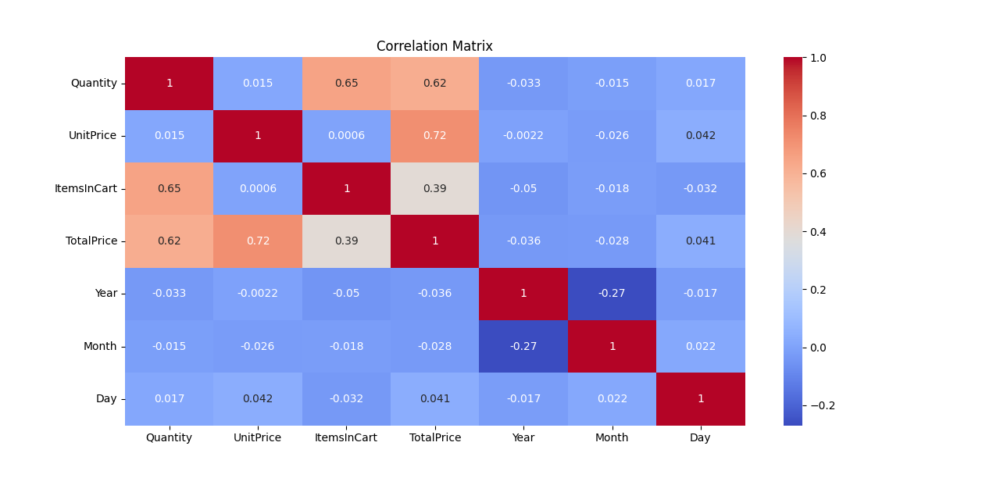
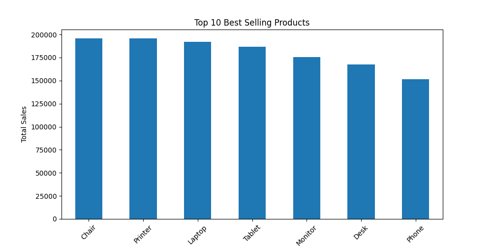

# Exploratory Data Analysis (EDA) Project

## Overview
This project performs Exploratory Data Analysis (EDA) on a preprocessed dataset using Python. The objective is to understand the dataset structure, identify patterns, analyze feature relationships, detect outliers, and gain insights through statistical summaries and visualizations.

## Technologies Used
- Python
- Pandas
- NumPy
- Matplotlib
- Seaborn

## Dataset
The analysis uses a preprocessed dataset:

```
preprocessed_dataset.csv
```

The dataset is assumed to be cleaned and ready for analysis.

## Features of Analysis

### 1. Dataset Overview
- Displays dataset shape
- Shows column information and data types
- Displays first five records

### 2. Missing Values Analysis
- Checks for missing values in all columns

### 3. Duplicate Records Detection
- Identifies duplicate rows in the dataset

### 4. Descriptive Statistics
- Generates summary statistics for numerical features
- Includes mean, median, standard deviation, minimum, and maximum values

### 5. Distribution Analysis
- Creates histograms for numerical features
- Helps understand data distribution patterns

### 6. Correlation Analysis
- Generates a correlation heatmap
- Identifies relationships between numerical variables

### 7. Target Variable Analysis
- Checks whether a target column exists
- Displays class distribution
- Visualizes target frequencies using a count plot

### 8. Outlier Detection
- Uses boxplots to identify potential outliers in numerical features

### 9. Sales Analysis
- Calculates total sales by product
- Displays Top 10 Best-Selling Products using a bar chart

## Project Structure

```
EDA_Project/
│
├── EDA.py
├── preprocessed_dataset.csv
├── README.md
└── output_visualizations/
```

## Installation

Install the required libraries:

```bash
pip install pandas numpy matplotlib seaborn
```

## Running the Project

Execute the Python script:

```bash
python EDA.py
```

## Output
The script generates:

- Dataset summary
- Missing value report
- Duplicate record report
- Statistical summary
- Feature distribution histograms
- Correlation heatmap
- Target distribution chart
- Outlier boxplots
- Top 10 best-selling products chart

## Sample Output






## Purpose
The purpose of this project is to perform comprehensive exploratory data analysis and extract meaningful insights that can support future machine learning models and business decision-making.

## Skills Demonstrated

- Data Cleaning
- Exploratory Data Analysis
- Data Visualization
- Statistical Analysis
- Python Programming
- Business Insight Generation

## Author

Nida Asghar  
BS Data Science  
Gift University, Gujranwala, Pakistan
